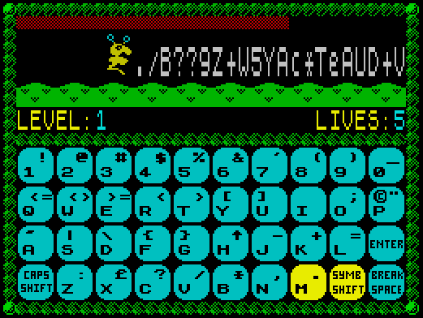

# Keyboard Trainer

A simplified ZX Spectrum remake of the popular touch typing training game [BabyType](https://dosgames.com/game/babytype/). Written in 1997 using Z80 Assembler with some BASIC fragments. The sources were unfortunately lost.

The game mostly "borrows" graphics from other games and tools; sound is created by typing some sheet music into [Wham!](https://worldofspectrum.org/archive/software/utilities/wham-the-music-box-melbourne-house)

You can [play the game online](https://rg-software.github.io/zx-keytrain/keyboard.html) with JSSpeccy 3 emulator.

The final boss stage is also [available separately](https://rg-software.github.io/zx-keytrain/keyboard-boss.html).